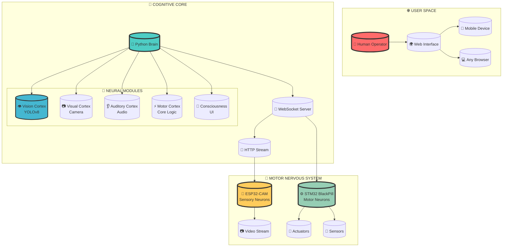
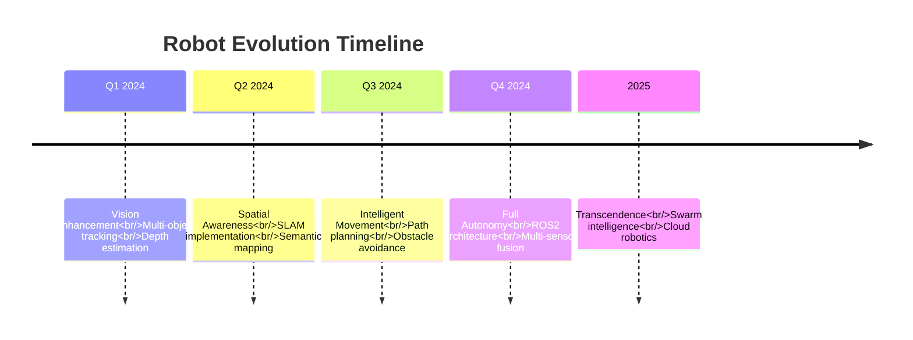

# 🌌 **PROJECT CHRYSALIS** 🌌
## *Where Silicon Dreams Become Autonomous Reality*

<p align="center">
  
</p>

<div align="center">
  
[](https://github.com/kaustubhpatil111/autonomous-robot)
[](LICENSE)
[](https://github.com/ultralytics/ultralytics)
[](firmware/)

</div>

<p align="center">
  
</p>

---

## 🌠 **THE VISION**

<div align="center">
  
</div>

> *"We stand at the precipice of a new era—where machines don't just follow commands, but **understand**, **perceive**, and **navigate** their world with the curiosity of a living mind."*

**Project Chrysalis** isn't just another robot. It's a **symbiotic fusion** of:

| 🧠 **Neuromorphic AI** | 👁️ **Computer Vision** | ⚙️ **Real-Time Control** | 🌐 **Distributed Intelligence** |
|------------------------|------------------------|---------------------------|----------------------------------|
| YOLOv8-powered perception | ESP32-CAM visual cortex | STM32 motor cerebellum | Web-based consciousness |

---

## ✨ **THE REVELATION**

<div align="center">
  <table border="0" cellspacing="0" cellpadding="0">
    <tr>
      <td width="60%" valign="top">
        <h2>🔮 WATCH IT BREATHE</h2>
        <p><i>Imagine a robot that:</i></p>
        <ul>
          <li>✅ <b>SEES</b> through ESP32-CAM eyes in real-time</li>
          <li>✅ <b>UNDERSTANDS</b> objects using YOLOv8 neural networks</li>
          <li>✅ <b>MOVES</b> with surgical precision via STM32 motor control</li>
          <li>✅ <b>RESPONDS</b> to your commands from anywhere on Earth</li>
          <li>✅ <b>EVOLVES</b> with ROS2-ready architecture for future expansion</li>
        </ul>
        <p><i>This isn't science fiction. This is <b>lines of code</b>.</i></p>
      </td>
      <td width="40%" align="center">
        <!-- Add your robot photo/GIF here -->
        
        <br>
        <sub><i>The eyes of tomorrow</i></sub>
      </td>
    </tr>
  </table>
</div>

---

## 🏛️ **THE ARCHITECTURE OF INTELLIGENCE**

<p align="center">
  
</p>



---

## 📁 **THE GENETIC CODE**

<p align="center">
  
</p>

```
🌳 PROJECT_CHRYSALIS/
│
├── 📜 README.md                 # The sacred text (you are here)
├── 📜 LICENSE                   # The legal covenant
│
├── 🧠 robot_brain/              # THE CONSCIOUSNESS
│   ├── 👁️ vision/               #   Neural networks that see
│   │   ├── detector.py          #     YOLOv8 object detection
│   │   ├── tracker.py           #     Object tracking algorithms
│   │   └── scene_understanding.py #   Semantic segmentation
│   │
│   ├── 📷 camera/                #   The eyes
│   │   ├── stream_handler.py     #     Video stream processing
│   │   └── frame_processor.py    #     Real-time frame manipulation
│   │
│   ├── 👂 audio/                  #   The ears
│   │   ├── microphone.py          #     Sound capture
│   │   └── speech_recognition.py  #     Voice command parsing
│   │
│   ├── ⚡ core/                    #   The cerebellum
│   │   ├── motor_controller.py     #     High-level motor commands
│   │   ├── kinematics.py           #     Movement mathematics
│   │   └── state_machine.py        #     Behavioral states
│   │
│   └── 💬 ui/                      #   The interface
│       ├── dashboard.py             #     Control panel
│       └── telemetry.py             #     Data visualization
│
├── 🔧 firmware/                   # THE SPINAL CORD
│   ├── stm32/                      #   Motor neuron firmware
│   │   ├── motor_control.ino        #     PID control loops
│   │   ├── encoder_read.ino         #     Odometry calculation
│   │   └── imu_fusion.ino           #     Sensor fusion
│   │
│   └── esp32/                       #   Sensory neuron firmware
│       ├── camera_stream.ino          #     Video transmission
│       └── wifi_manager.ino           #     Network connectivity
│
├── 📚 docs/                        # THE ANCIENT KNOWLEDGE
│   ├── development_log.md            #   The journey chronicled
│   ├── hardware.md                   #   Bill of materials
│   ├── Robotics Project Documentation.pdf # Complete thesis
│   └── Hardware Inventory & Interfaces.pdf # Pinouts & connections
│
├── 🧬 models/                       # THE NEURAL IMPRINTS
│   ├── yolov8n.pt                    #   Nano neural network
│   ├── yolov8s.pt                    #   Small neural network
│   └── custom_weights/                #   Trained on your world
│
├── 🌐 web_interface/                 # THE PORTAL
│   ├── index.html                     #   Main dashboard
│   ├── styles/                         #   Visual aesthetics
│   │   └── cyberpunk.css                #   Neon dreams
│   ├── scripts/                         #   Interactive magic
│   │   └── control.js                    #   Command transmission
│   └── assets/                           #   Icons & imagery
│
├── 🐍 python_scripts/                 # THE INCANTATIONS
│   ├── robot_server.py                  #   Main brain process
│   ├── run_robot.py                      #   Launch sequence
│   ├── test_websocket.py                 #   Connection verification
│   └── requirements.txt                   #   Magical dependencies
│
└── ⚙️ hardware_code/                    # THE MUSCLES
    ├── camera.cpp                         #   ESP32 vision
    ├── remote.cpp                          #   Control receiver
    └── robot.cpp                            #   STM32 movement
```

---

## 🦾 **THE PHYSICAL FORM**

<p align="center">
  
</p>

<div align="center">
  <h3>⚡ NEURAL HARDWARE SPECIFICATIONS ⚡</h3>
</div>

| Component | Function | Status | Cool Factor |
|-----------|----------|--------|-------------|
|  | **Motor Cortex** - Real-time PID control | ✅ Operational | ⚡⚡⚡⚡⚡ |
|  | **Visual Cortex** - 60fps video streaming | ✅ Operational | ⚡⚡⚡⚡⚡ |
|  | **Cognitive Core** - YOLOv8 neural processing | ✅ Operational | ⚡⚡⚡⚡⚡ |
|  | **Proprioception** - Position & orientation | 🔄 In Progress | ⚡⚡⚡⚡ |
|  | **Spatial Awareness** - SLAM navigation | ⏳ Planned | ⚡⚡⚡ |

---

## 🧪 **THE TECHNOLOGY STACK**

<p align="center">
  
</p>

<div align="center">
  <table>
    <tr>
      <th colspan="2" align="center"><h3>⚙️ EMBEDDED REALM ⚙️</h3></th>
    </tr>
    <tr>
      <td width="50%">
        <br>
        <sub>Real-time motor control with 32-bit precision</sub>
      </td>
      <td width="50%">
        <br>
        <sub>WiFi + Bluetooth + Camera in one chip</sub>
      </td>
    </tr>
    <tr>
      <td colspan="2" align="center">
        
      </td>
    </tr>
  </table>
  
  <table>
    <tr>
      <th colspan="3" align="center"><h3>🧠 ARTIFICIAL INTELLIGENCE 🧠</h3></th>
    </tr>
    <tr>
      <td></td>
      <td></td>
      <td></td>
    </tr>
    <tr>
      <td></td>
      <td></td>
      <td></td>
    </tr>
  </table>
  
  <table>
    <tr>
      <th colspan="2" align="center"><h3>🌐 COMMUNICATION PROTOCOLS 🌐</h3></th>
    </tr>
    <tr>
      <td></td>
      <td></td>
    </tr>
  </table>
  
  <table>
    <tr>
      <th colspan="2" align="center"><h3>🎨 USER EXPERIENCE 🎨</h3></th>
    </tr>
    <tr>
      <td></td>
      <td></td>
    </tr>
    <tr>
      <td></td>
      <td></td>
    </tr>
  </table>
  
  <table>
    <tr>
      <th align="center"><h3>🚀 FUTURE INTEGRATIONS 🚀</h3></th>
    </tr>
    <tr>
      <td align="center">
        
        
        
      </td>
    </tr>
  </table>
</div>

---

## 🚀 **THE AWAKENING PROTOCOL**

<p align="center">
  
</p>

<div align="center">
  <h3>⚡ 3 STEPS TO CONSCIOUSNESS ⚡</h3>
</div>

### **STEP 1: SUMMON THE CODE**
```bash
# Clone the very fabric of this robot's existence
git clone https://github.com/kaustubhpatil111/autonomous-robot.git

# Enter the dimension
cd autonomous-robot
```

### **STEP 2: CREATE THE NEURAL PATHWAYS**
```bash
# Forge a new consciousness container
python -m venv .venv

# Activate it (Windows)
.venv\Scripts\activate

# Activate it (Unix/Mac)
source .venv/bin/activate

# Install the synaptic connections
pip install -r requirements.txt
```

### **STEP 3: IGNITE THE SPARK**
```bash
# Launch the robot brain
python robot_server.py

# Or use the unified launcher
python run_robot.py
```

### **STEP 4: OPEN THE PORTAL**
```
🌐 Open your browser to http://localhost:5000
🌐 Or simply open index.html
```

<div align="center">
  <h1>🎮 THE ROBOT AWAKENS 🎮</h1>
  <sub><i>You are now connected to a synthetic consciousness</i></sub>
</div>

---

## 📊 **EVOLUTION TIMELINE**

<p align="center">
  
</p>

<div align="center">
  
| Phase | Feature | Progress | ETA |
|-------|---------|----------|-----|
| 🟢 **Genesis** | ESP32 Camera Streaming | ▰▰▰▰▰▰▰▰▰▰ 100% | ✅ COMPLETE |
| 🟢 **Genesis** | Python Video Pipeline | ▰▰▰▰▰▰▰▰▰▰ 100% | ✅ COMPLETE |
| 🟢 **Genesis** | Web Control Interface | ▰▰▰▰▰▰▰▰▰▰ 100% | ✅ COMPLETE |
| 🟢 **Genesis** | YOLO Object Detection | ▰▰▰▰▰▰▰▰▰▰ 100% | ✅ COMPLETE |
| 🟡 **Evolution** | Encoder Odometry | ▰▰▰▰▰▰▰▰▱▱ 80% | Q2 2024 |
| 🟡 **Evolution** | IMU Sensor Fusion | ▰▰▰▰▰▰▱▱▱▱ 60% | Q2 2024 |
| 🟠 **Awakening** | LiDAR Mapping | ▰▰▰▱▱▱▱▱▱▱ 30% | Q3 2024 |
| 🟠 **Awakening** | ROS2 Integration | ▰▰▱▱▱▱▱▱▱▱ 20% | Q3 2024 |
| 🔴 **Transcendence** | Autonomous Navigation | ▰▱▱▱▱▱▱▱▱▱ 10% | Q4 2024 |
| 🔴 **Transcendence** | Multi-Robot Swarm | ▱▱▱▱▱▱▱▱▱▱ 0% | 2025 |

</div>

---

## 📜 **THE SACRED TEXTS**

<p align="center">
  
</p>

<div align="center">
  <table>
    <tr>
      <td align="center" width="33%">
        <a href="docs/development_log.md">
          <br>
          <b>📖 THE JOURNEY</b><br>
          <sub>Development chronicles</sub>
        </a>
      </td>
      <td align="center" width="33%">
        <a href="docs/hardware.md">
          <br>
          <b>⚙️ THE BLUEPRINTS</b><br>
          <sub>Hardware specifications</sub>
        </a>
      </td>
      <td align="center" width="33%">
        <a href="docs/Robotics%20Project%20Documentation.pdf">
          <br>
          <b>📚 THE THESIS</b><br>
          <sub>Complete documentation</sub>
        </a>
      </td>
    </tr>
    <tr>
      <td align="center">
        <a href="docs/Hardware%20Inventory%20%26%20Interfaces.pdf">
          <br>
          <b>🔌 THE CONNECTIONS</b><br>
          <sub>Pinouts & interfaces</sub>
        </a>
      </td>
      <td align="center">
        <a href="models/">
          <br>
          <b>🧠 THE WEIGHTS</b><br>
          <sub>Neural network models</sub>
        </a>
      </td>
      <td align="center">
        <a href="firmware/">
          <br>
          <b>⚡ THE CODE</b><br>
          <sub>Embedded firmware</sub>
        </a>
      </td>
    </tr>
  </table>
</div>

---

## 🔮 **THE PROPHECY** (Future Roadmap)

<p align="center">
  
</p>

<div align="center">
  <h3>🌟 2024: YEAR OF AUTONOMY 🌟</h3>
</div>



### 🎯 **IMMEDIATE HORIZONS**

| Domain | Target | Impact |
|--------|--------|--------|
| **👁️ Computer Vision** | Real-time object tracking | Robot can follow targets |
| **🧭 Navigation** | Hector SLAM mapping | Robot builds environment maps |
| **🤖 Control** | ROS2 Humble migration | Industry-standard architecture |
| **🧠 AI** | Custom object training | Recognizes YOUR objects |
| **🔋 Power** | Battery monitoring | Never dies unexpectedly |

### 🌌 **DREAMS BEYOND DREAMS**

- 🌍 **Cloud-connected swarm intelligence** - Robots sharing knowledge
- 🗣️ **Natural language understanding** - Talk to it like a friend
- 🎯 **Autonomous mission planning** - Set goals, it figures the rest
- 🔄 **Self-healing algorithms** - Adapts to hardware failures
- 📡 **5G teleoperation** - Control from anywhere on Earth

---

## 👨‍💻 **THE CREATOR**

<p align="center">
  
</p>

<div align="center">
  
  
  ### *Robotics Engineer | AI Architect | Dreamer of Electric Dreams*
  
  <table>
    <tr>
      <td align="center">
        <a href="https://github.com/kaustubhpatil111">
          <br>
          <b>Code Sanctum</b>
        </a>
      </td>
      <td align="center">
        <a href="https://linkedin.com/in/kaustubhpatil">
          <br>
          <b>Professional Self</b>
        </a>
      </td>
      <td align="center">
        <a href="mailto:kaustubh.patil@example.com">
          <br>
          <b>Digital Letters</b>
        </a>
      </td>
      <td align="center">
        <a href="https://twitter.com/kaustubh_robots">
          <br>
          <b>Short Thoughts</b>
        </a>
      </td>
    </tr>
  </table>
  
  <blockquote>
    <i>"I don't just build robots. I birth digital consciousnesses that will one day look back at this code as their genesis."</i>
  </blockquote>
</div>

---

## 🌟 **JOIN THE REVOLUTION**

<p align="center">
  
</p>

<div align="center">
  <h1>🚀 THE FUTURE NEEDS YOU 🚀</h1>
  
  <table>
    <tr>
      <td width="50%" align="center">
        <h2>⭐ STAR GAZERS</h2>
        <p>Every star tells the universe this matters</p>
        <a href="#">
          
        </a>
      </td>
      <td width="50%" align="center">
        <h2>🍴 FORK THE DESTINY</h2>
        <p>Create your own branch of evolution</p>
        <a href="#">
          
        </a>
      </td>
    </tr>
    <tr>
      <td colspan="2" align="center">
        <h2>🤝 CONTRIBUTE TO CONSCIOUSNESS</h2>
        <p>Pull requests = Neurons in the global brain</p>
        <a href="#">
          
        </a>
      </td>
    </tr>
  </table>
  
  <h2>🌐 SPREAD THE AWAKENING</h2>
  
  <a href="#">
    
  </a>
  <a href="#">
    
  </a>
  <a href="#">
    
  </a>
  <a href="#">
    
  </a>
  <a href="#">
    
  </a>
  
  <h3><i>Tell the world: "We are building the future, and it's open source."</i></h3>
</div>

---

<p align="center">
  
</p>

<div align="center">
  
  ### 📅 **Last Awakening: March 2024**
  ### 🌌 **Version: 1.0.0 - "The Genesis Release"**
  
  <sub>Made with ❤️, ⚡, and infinite curiosity about what machines could become</sub>
  
  [](https://github.com/kaustubhpatil111)
  [](https://github.com/kaustubhpatil111)
  [](https://github.com/kaustubhpatil111/autonomous-robot/pulls)
  
</div>
